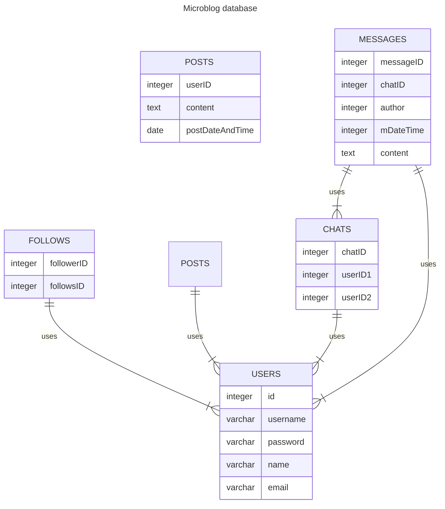

# Microblog
###### Projektbericht

[toc]

___

___

## Finn Notizen

- 31.5. Fähigkeit, Posts zu schreiben (2 hrs)
- 2.6. Mehrere Bugfixes (1 hr)
- 2.6. first CSS (30 min)
- 4.6. weitere CSS gestaltung (3 hrs)

Besprechung 09.06:

- follow abfragen sql fertig machen
- Datenbank für chats anpassen
- Serafin: Diagramm Webstruktur
- Finn: APRG Projektbericht 1v
- Alex: Navigation final, und bissel polish evtl (Popup) 